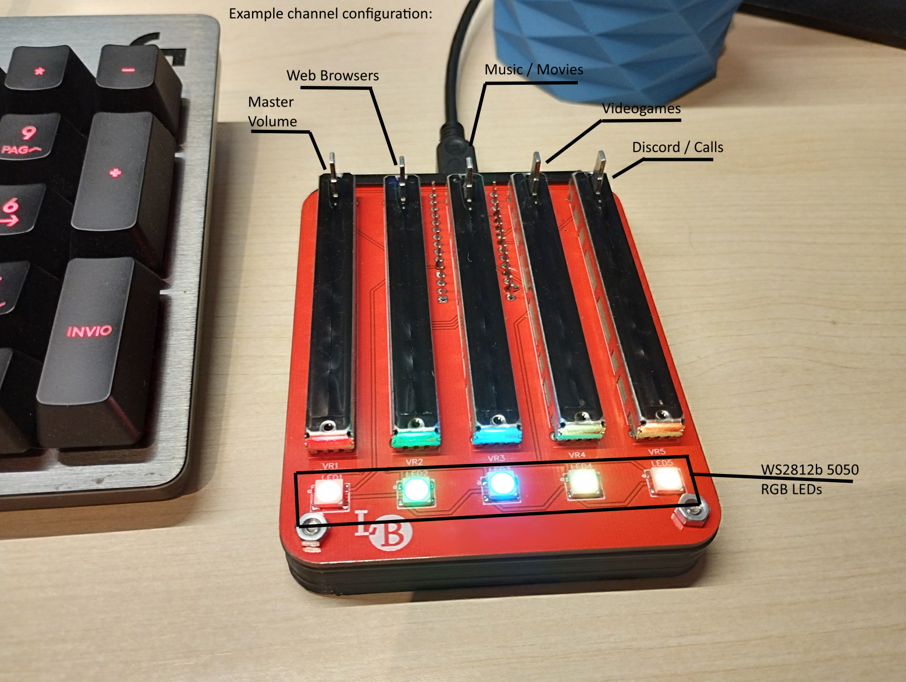

# deej ... with LEDs

deej is an **open-source hardware volume mixer** for Windows and Linux PCs. It lets you use real-life sliders (like a DJ!) to **seamlessly control the volumes of different apps** (such as your music player, the game you're playing and your voice chat session) without having to stop what you're doing.

This fork of deej lets you set the colour of RGB LEDs at runtime without re-flashing the arduino, by just editing config.yaml.



## Instructions and Information
For all the information you need, please refer back to the original GitHub repository: [omriharel/deej](https://github.com/omriharel/deej).
There is also an official [Discord Server](https://discord.gg/nf88NJu).

## Arduino firmware differences
An updated Arduino sketch is included in this repository, it is deej/arduino/deej-5-sliders-WS2812b.

## PC configuration differences
The config.yaml file is read periodically by the desktop application at runtime, so the changes can be tested out immediately.

To use led colors, add them in a list. The length of the list must be equal to the number of LEDs / channels used.

Colors are in RGB Hex format: 0xFF0000 is red, 0x00FF00 is green and 0x0000FF is blue. All combinations are allowed and decoded by the arduino firmware.
You can use any [color picker website](https://imagecolorpicker.com/) to get the color you want, just remember to write it with the 0xRRGGBB format and **not** the html one, #RRGGBB.

A possible config.yaml file might look like this:

```yaml
slider_mapping:
  0: master
  1: chrome.exe
  2: spotify.exe
  3:
    - pathofexile_x64.exe
    - rocketleague.exe
  4: discord.exe

led_colors:
  - 0xFF00FF # Magenta
  - 0x00FFFF # Aqua
  - 0x00FF00 # Lime green
  - 0xFFFF00 # Yellow
  - 0xFF3F00 # Orange

# set this to true if you want the controls inverted (i.e. top is 0%, bottom is 100%)
invert_sliders: false

# settings for connecting to the arduino board
com_port: COM5
baud_rate: 115200

# adjust the amount of signal noise reduction depending on your hardware quality
# supported values are "low" (excellent hardware), "default" (regular hardware) or "high" (bad, noisy hardware)
noise_reduction: default
```
